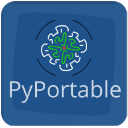

# PyPortable -- Alpha



**Current Version: Alpha**

PyPortable is a Python tool designed to simplify the creation of portable Python applications. 

## ✨ Key Features

* **No Virtual Environments Needed:** PyPortable leverages `python-embeddable` distributions to create self-contained applications, eliminating the need for users to set up or manage virtual environments.

* **Windows Defender Friendly:** The tool automatically generates a VBS (Visual Basic Script) file to launch your portable Python application. This VBS file is less likely to be flagged or blocked by Windows Defender and other antivirus software, ensuring a smooth experience for your end-users.

* **Effortless Execution:** End-users can simply double-click the generated VBS file to run your portable Python application, providing a seamless and user-friendly experience. Your Python program will also run using the pythonw.exe, so there will no console output. 

* **Self-Contained:** Your entire application, including its Python interpreter and all dependencies, is packaged into a single, portable directory.

## 🚀 How it Works


1.  **Project Selection:** You select your existing Python project directory.

2.  **Output Directory:** You specify where the portable application should be created.

3.  **Python Version:** You choose the desired Python version (PyPortable can fetch available `python-embeddable` versions).

4.  **Dependency Installation:** PyPortable handles the installation of your project's `requirements.txt` dependencies within the portable Python environment.

5.  **VBS Launcher Creation:** A VBS script is generated that intelligently launches your main Python file using the portable Python interpreter.

6.  **Shortcut Creation:** A shortcut to the VBS launcher is placed in the root of your portable application directory for easy access.

## 🛠️ Installation

```

git clone https://github.com/A-Temur/PyPortable.git
cd PyPortable

# Install PyPortable's own dependencies 
pip install -r requirements.txt

```

## 📖 Usage

1.  Run the `final_gui.py` (or your main GUI file) to launch the PyPortable application.

2.  Follow the on-screen instructions to:

    * Select your Python project directory.

    * Choose an output directory for your portable application.

    * Specify the main Python file to execute.

    * Select the desired Python version (or provide a custom `python-embeddable` ZIP).

3.  Click "Create PyPortable Application".

PyPortable will then create your self-contained portable application in the specified output directory.

## Notes
Developed via Python 3.13